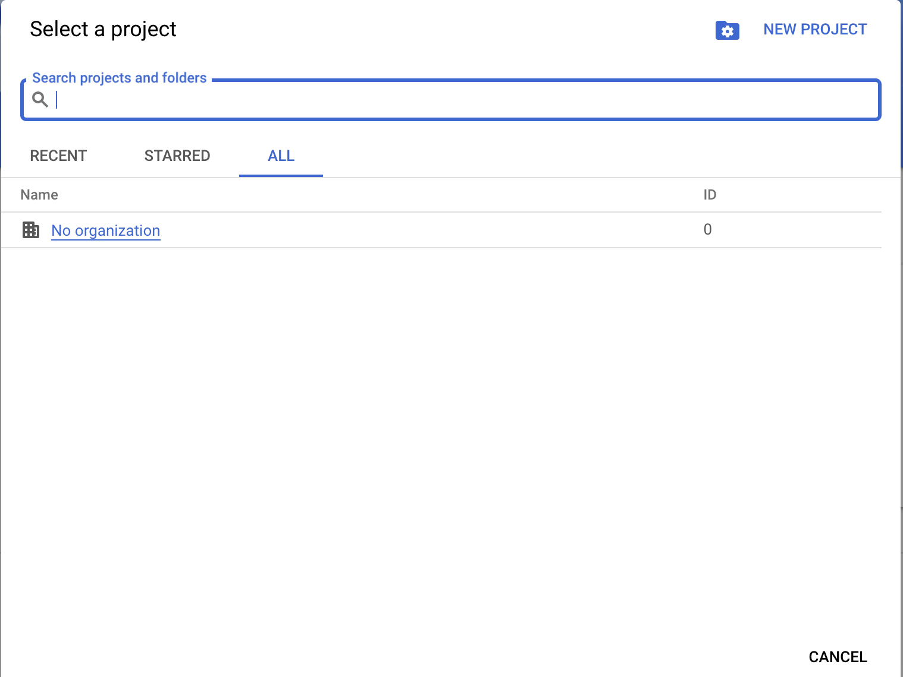
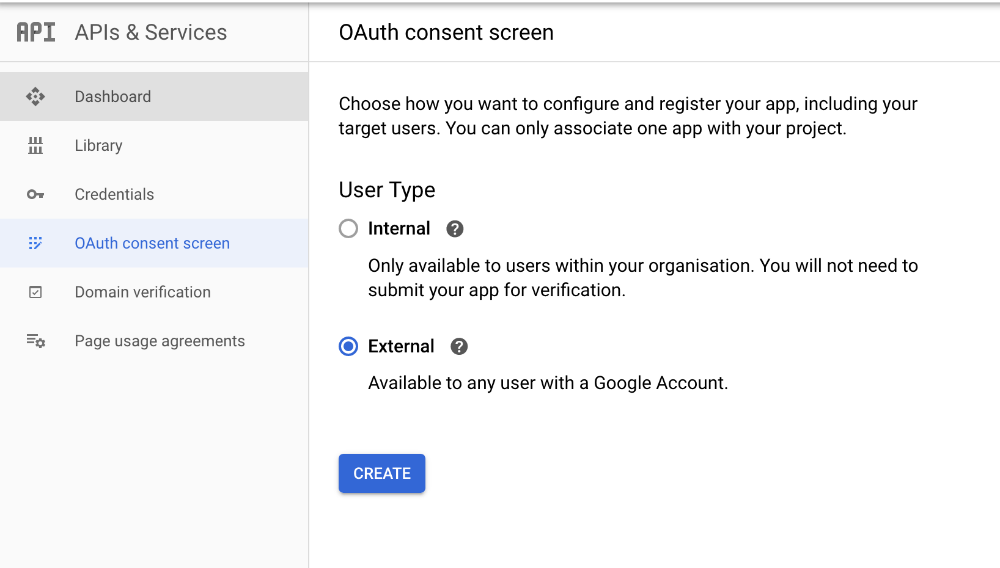
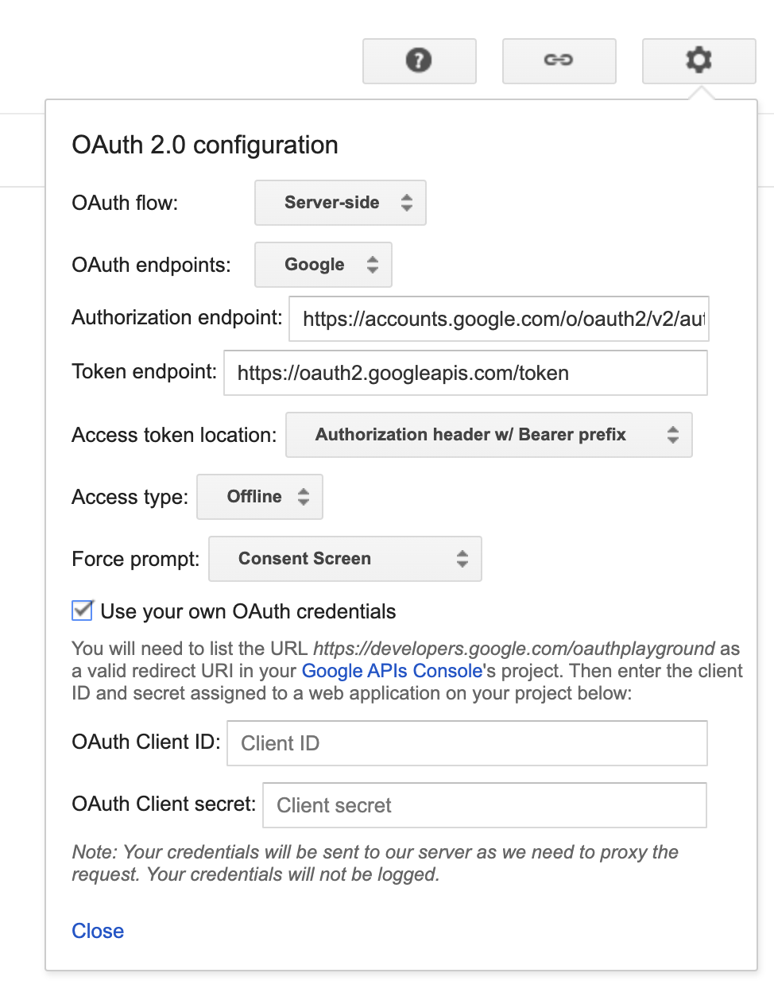

# Configure Gmail API

_Owners_: @niveathika \
_Reviewers_: @daneshk \
_Created_: 2022/11/09 \
_Updated_: 2023/11/13  

## Introduction

To utilize the Gmail connector, you must have access to the Gmail REST API through a [Google Cloud Platform (GCP)](https://console.cloud.google.com/) account and a project under it. If you do not have a GCP account, you can sign up for one [here](https://cloud.google.com/).

### Step 1: Create a Google Cloud Platform Project

1. Open the [Google Cloud Platform Console](https://console.cloud.google.com/).

2. Click on the project drop-down menu and select an existing project or create a new one for which you want to add an API key.

    

### Step 2: Enable Gmail API

1. Navigate to the **Library** tab and enable the Gmail API.

    

### Step 3: Configure OAuth consent

1. Click on the **Configure consent screen** tab in the Google Cloud Platform console.

    

2. Provide a name for the consent application and save your changes.

### Step 4: Create OAuth Client

1. Navigate to the **Credentials** tab in your Google Cloud Platform console.

2. Click on **Create credentials** and select **OAuth client ID** from the dropdown menu.

    

3. You will be directed to the **Create OAuth client ID** screen, where you need to fill in the necessary information as follows:

        | Field                     | Value |
        | ------------------------- | ----- |
        | Application type          | Web Application |
        | Name                      | GmailConnector  |
        | Authorized redirect URIs  | https://developers.google.com/oauthplayground |

4. After filling in these details, click on **Create**.

5. Make sure to save the provided Client ID and Client secret.

### Step 5: Get the access and refresh token

**Note**: It is recommended to use the OAuth 2.0 playground to obtain the tokens.

1. Configure the OAuth playground with the OAuth client ID and client secret.

    

2. Authorize the Gmail APIs (Select all except the metadata scope).

    

3. Exchange the authorization code for tokens.

    
