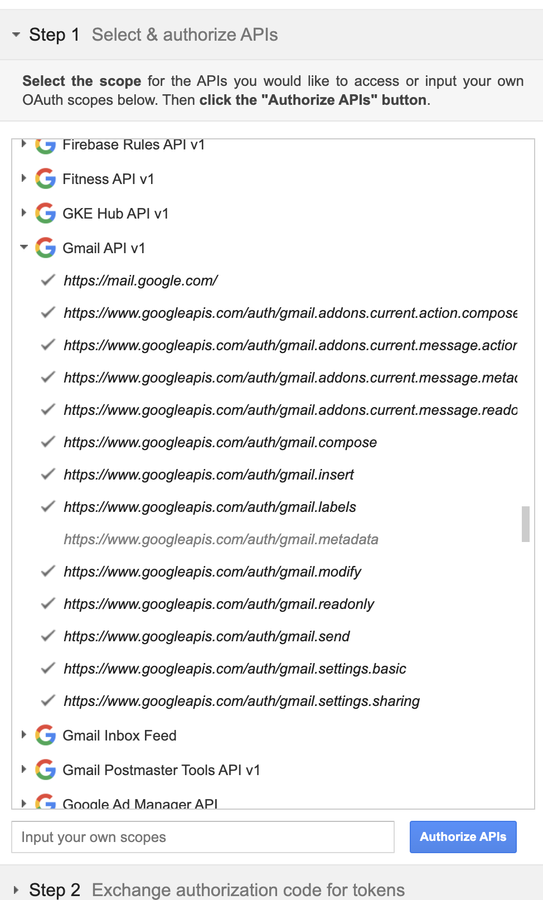
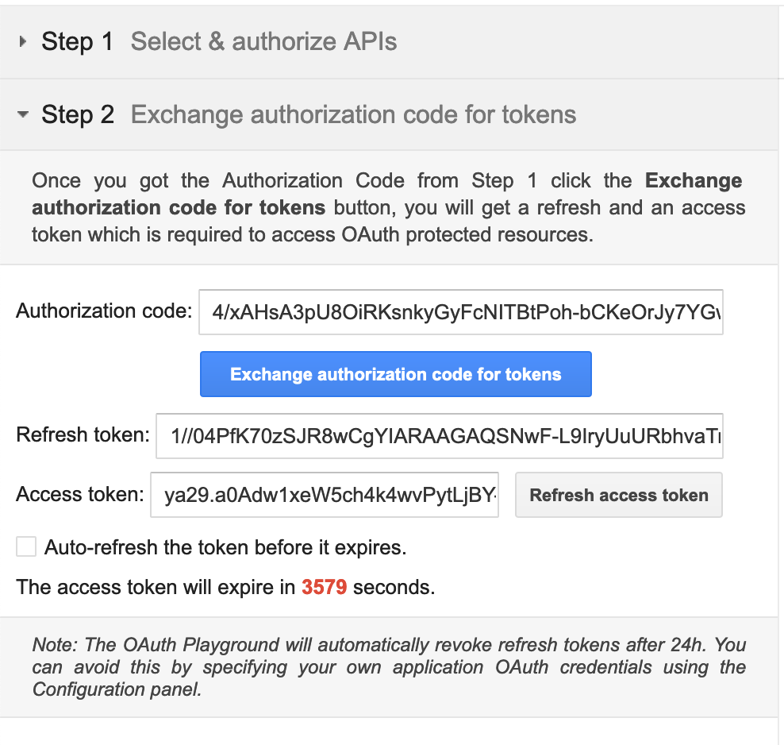

# Configure Gmail API

_Owners_: @niveathika \
_Reviewers_: @daneshk \
_Created_: 2022/11/09 \
_Updated_: 2023/11/13 \

## Introduction

To use the Gmail connector, you need to have access to the Gmail REST API via a [Google Cloud Platform (GCP)](https://console.cloud.google.com/) account and a project under it. If you do not have a GCP account, you can sign up for one [here](https://cloud.google.com/).

## Step 1: Create a Google Cloud Platform Project

1. Open the [GCP Console](https://console.cloud.google.com/).
2. Click on the project drop-down and select or create the project for which you want to add an API key.

    

3. Navigate to the **Library** and enable the Gmail API.

    

## Step 2: Create OAuth Client ID

1. Navigate to the **Credentials** tab in your Google Cloud Platform console.

2. Click  **Create credentials** and from the dropdown menu, select **OAuth client ID**.

    

3. You will be directed to the **OAuth consent** screen, in which you need to fill in the necessary information below.

    | Field                     | Value |
    | ------------------------- | ----- |
    | Application type          | Web Application |
    | Name                      | GmailConnector  |
    | Authorized redirect URIs  | https://developers.google.com/oauthplayground |

    After filling in these details, click **Create**.

    **Note**: Save the provided Client ID and Client secret.

## Step 3: Get the access token and refresh token

**Note**: It is recommended to use the OAuth 2.0 playground to obtain the tokens.

1. Configure the OAuth playground with the OAuth client ID and client secret.

    

2. Authorize the Gmail APIs.

    

2. Exchange the authorization code for tokens.

    
